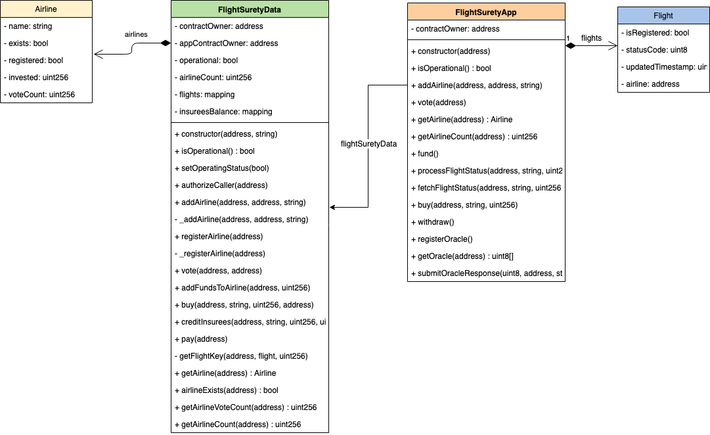
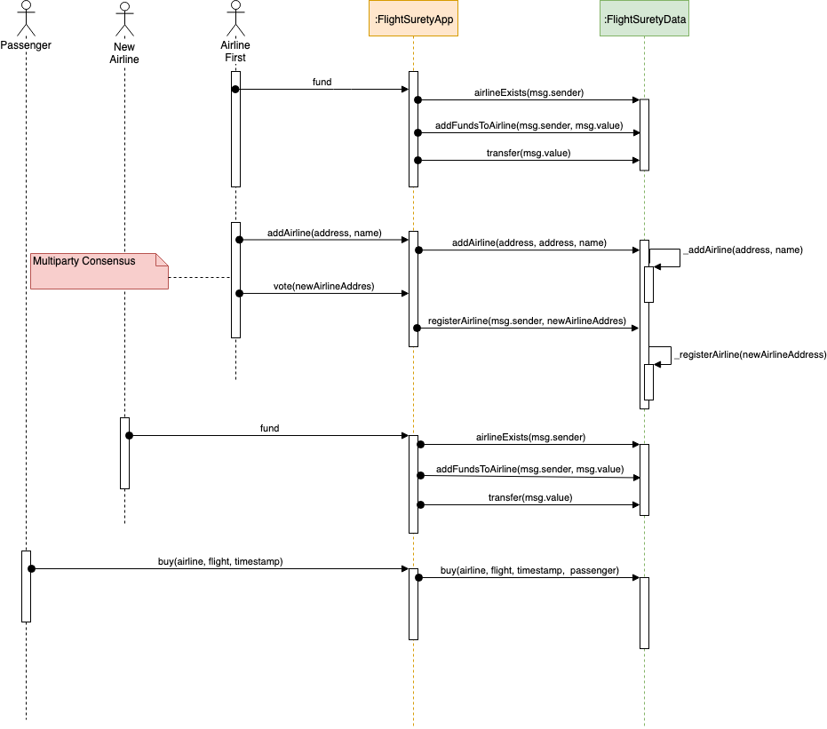
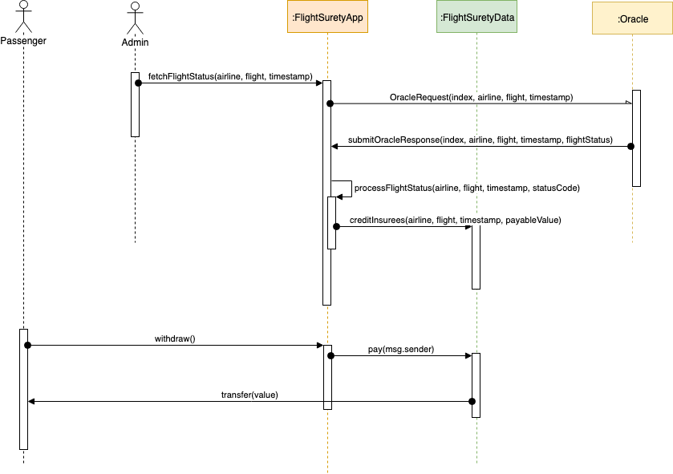

# José Marcelo Santuci - Udacity Blockchain Course - FlightSurety Project

This is the submission of FlightSurety Project of Udacity Blockchain course.

1. Contract Address: 0x94cC82D6B4E132f105A0BA2881A7c291f42ef830
2. Program version: 1.0.0
3. Node version: v10.16.0
4. Truffle version: v5.0.24 (core: 5.0.24)
5. Web3 version: 1.2.1

## UML

### Class Diagram

### Sequence Diagram - Buy Insurance

### Sequence Diagram - Withdraw Insurance

